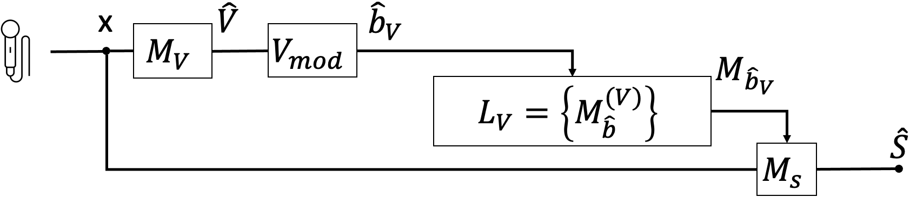

# A model selection method for room shape classification based on mono speech signals

## 1, 2 - Introduction to the problem

Each audio recording contains a huge amount of forensic traces.
In principle, from the analysis of a speech recording, it is possible to extract details that range from the estimation of the source device used for its acquisition, to environmental characteristics.

However, studies in the acoustic analysis and audio forensic fields throw light on the lack of tools for geometrical classification based on reverberant speech audio.

Despite acoustic analysis algorithms for estimating parameters like volume, reverberation time and enclosure type (e.g. small room, hall, stadium) were investigated in the literature, there is still room for improvement.

This study aims at widening the set of possible room parameters which can be considered for audio analysis. In detail, it introduces the topic of room shape classification based on reverberant speech signals.

## 3 - Method

The proposed methodology fixes some volume and reverberation time bands to enhance the performances of the shape classifiers and to establish a relationship among volume and geometry estimation performances.

To do so, either a preliminary volume or a reverberation time estimation is performed to retrieve a band index estimate.

Depending on the band index estimate, we retrieve the best shape classification model. Such estimator is used to prove whether a speech signal has been acquired in a room of a certain shape.

### 3.1 - Entry-point files for method implementation

- `./src/main.py`
- `./src/refactors/leaf-audio/example/main.py`

## 4 - Results

We provided a room shape classification system based on a mono speech signal. Such system is data-driven and for it we provided an ad-hoc dataset of RIRs and reverberant signals.

We discovered the relevance of the initial part of the reverberation tail within the classification task.

     

What is more, we demonstrated a direct relation of volume regression spread and shape classification accuracy.

Our research shows promising results even in the reverberant speech study case. However, we observe some difficulties both in dealing with rectangular rooms and coping with rooms of small size.
